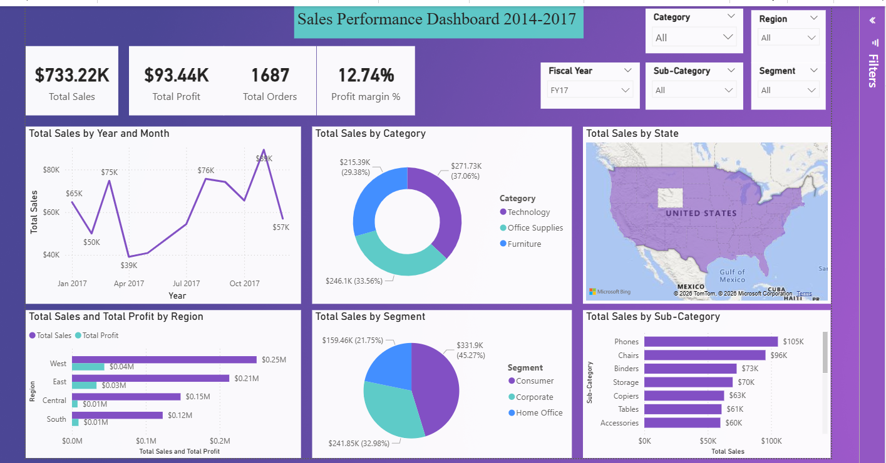

# 📊 Sales Dashboard – Power BI

## 📌 Project Overview

This project presents an interactive **Sales Analytics Dashboard** developed using Microsoft Power BI.

The dashboard analyzes sales and profitability data to identify business trends, regional performance, product performance, and customer segment insights.

The goal of this project is to transform raw sales data into meaningful and actionable business insights.

---

## 🎯 Business Questions

This dashboard was designed to answer questions such as:

- What are the total sales and total profit?
- How are sales changing over time?
- Which product categories generate the most sales?
- Which regions perform best?
- Which customer segments contribute the most sales?
- Which sub-categories have strong or weak performance?
- How does profitability vary across regions and categories?

---

## 📊 Key KPIs

The dashboard provides key performance indicators including:

- 💰 Total Sales
- 💵 Total Profit
- 📦 Total Orders
- 📈 Profit Margin
- 🗺️ Regional Sales Performance
- 🏷️ Category & Sub-Category Performance

---

## 🔎 Dashboard Features

### Sales Trend Analysis
Analyze sales performance across different months and years.

### Category Analysis
Compare sales across different product categories.

### Regional Analysis
Analyze sales and profit performance across different regions and states.

### Customer Segment Analysis
Compare performance across different customer segments.

### Sub-Category Analysis
Identify high-performing and low-performing product sub-categories.

### Interactive Filters
Users can filter the dashboard by:

- Fiscal Year
- Sub-Category
- Segment
- Region
- Category

---

## 🛠️ Tools & Technologies

- **Microsoft Power BI**
- **Power Query**
- **DAX**
- **Microsoft Excel**
- **Data Visualization**

---

## 🧹 Data Preparation

The dataset was prepared and transformed before visualization.

The process included:

- Reviewing the dataset structure
- Handling data types
- Cleaning and transforming data
- Creating calculated measures
- Building relationships where required
- Creating DAX measures for KPIs
- Designing interactive visualizations

---

## 📈 Dashboard Preview

---

## 💡 Key Insights

Based on the dashboard analysis:

- 💰 The dashboard reports **$733.22K in total sales** and **$93.44K in total profit**, with a **12.74% profit margin**.
- 🏆 **Technology** is the highest-performing category, generating approximately **$271.73K in sales (37.06%)**.
- 📊 **Office Supplies** contributes approximately **$246.46K (33.56%)**, while Furniture contributes approximately **$215.39K (29.38%)**.
- 👥 The **Consumer segment** contributes the largest share of sales at approximately **45.27%**.
- 🗺️ The **West region** shows the highest sales performance among the regions displayed in the dashboard.
- 📱 **Phones** is the highest-selling sub-category in the displayed analysis, followed by Chairs and Binders.
- 📈 The monthly sales trend shows noticeable fluctuations, indicating opportunities to investigate periods of stronger and weaker performance.

## 📂 Files Included

| File | Description |
|---|---|
| `sales-dashboard.pbix` | Power BI dashboard file |
| `superstore-sales-data.xlsx` | Dataset used for analysis |
| `README.md` | Project documentation |

---

## 🚀 Future Improvements

Potential improvements to this project include:

- Adding advanced DAX measures
- Adding year-over-year growth analysis
- Creating customer-level analysis
- Adding sales forecasting
- Improving dashboard navigation and user experience

---

## 👩‍💻 Author

**Sanapala Bhargavi**

Aspiring Data Analyst

🔗 [GitHub](https://github.com/Sanapalabhargavi)

🔗 [LinkedIn](https://www.linkedin.com/in/bhargavi-sanapala-bbb4952a8/)

📧 [Email](mailto:bhargavisanapala7@gmail.com)
